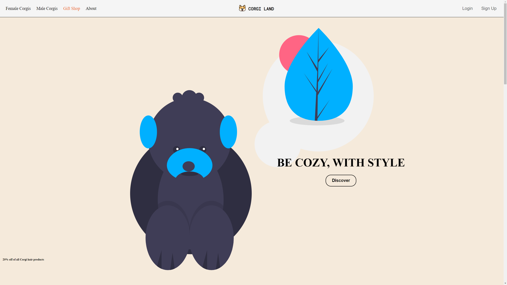
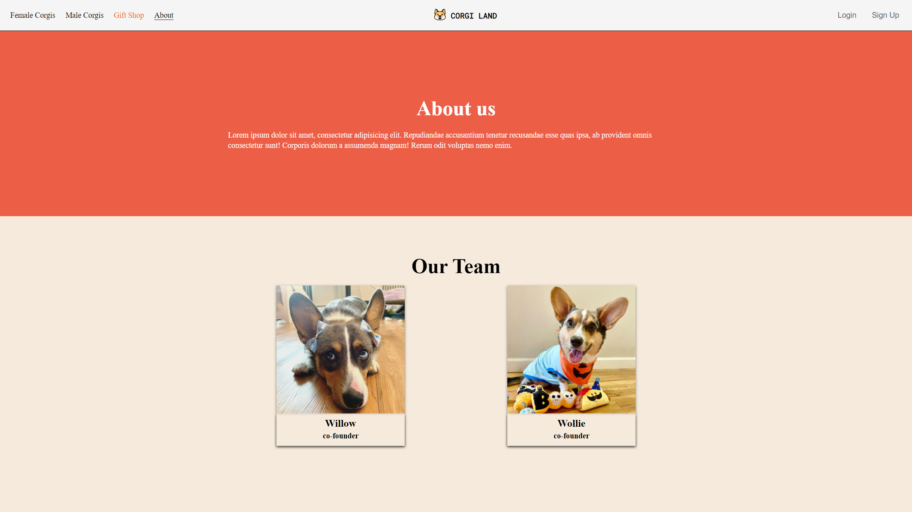

# Project Title

Corgi Land
 

 Access my site at https://corgiland.tyler-allen.com/

## About The App

[Corgi Land] is a mobile responsive website with different pages leading to different parts of the website. The site has example of different items for sale along with login and signup page with validation. 

## Screenshots

## Technologies

  &nbsp;
  &nbsp;
  &nbsp;
  &nbsp;
  &nbsp;
  &nbsp;

## Approach

Built with React and styled with SASS and Maerial UI. react router is used to navigate through the app. yup and react hook form for signup validation.

